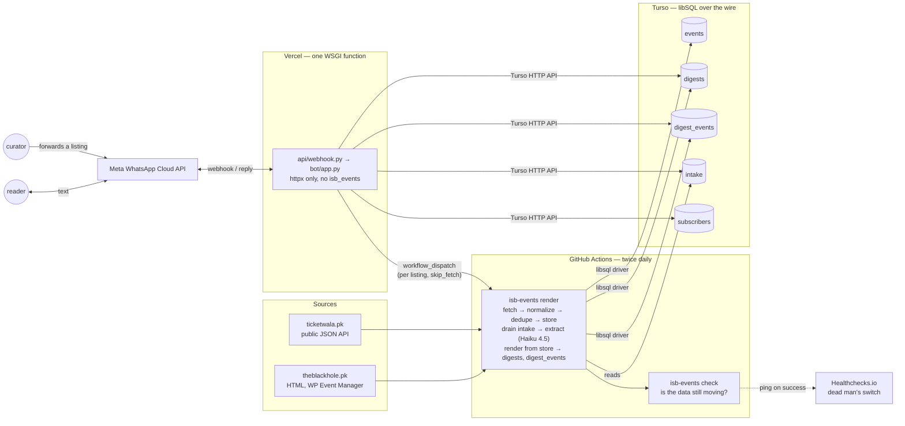
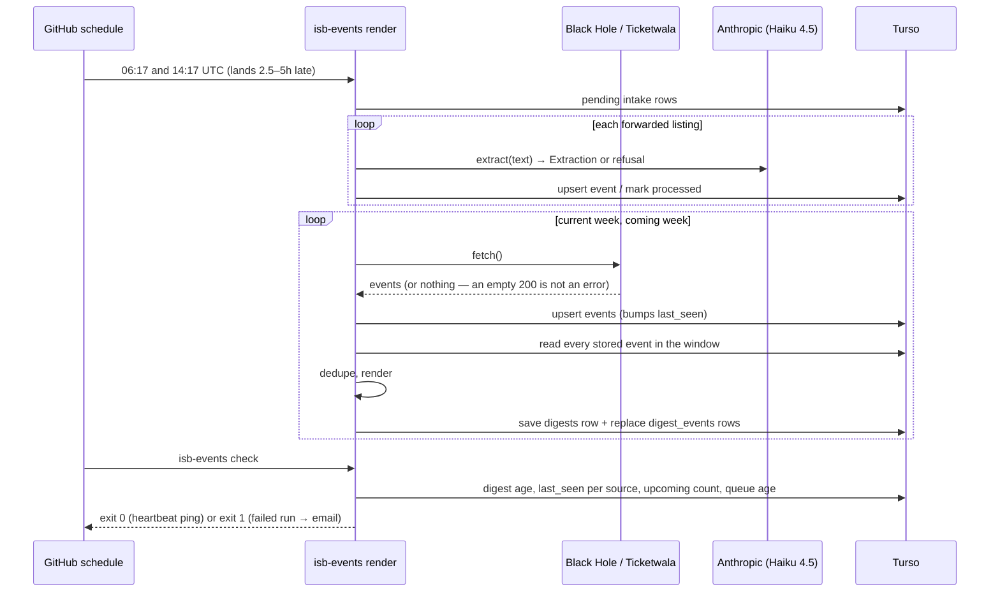
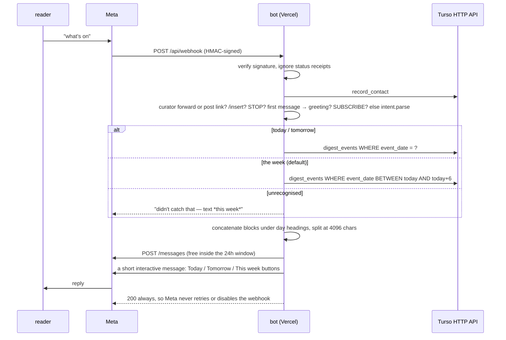
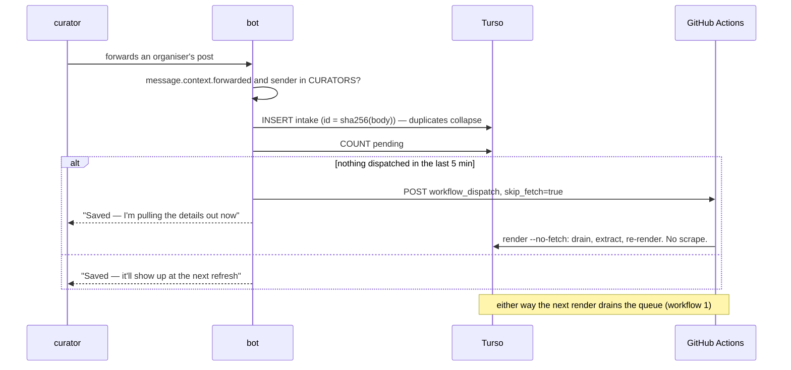
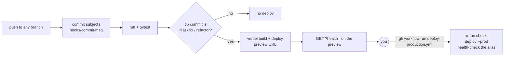

# Architecture v1

isb-events, as it stands on 2026-09-17. This is the map: what the pieces are,
how a request or a cron tick moves through them, and which rules keep the
shape from drifting. `CLAUDE.md` is the project's memory of *why* each
decision was made; `README.md` is how to operate it; `RUNBOOK.md` is what to
run when it breaks. This file is the one to read first.

## In one paragraph

A GitHub Actions cron scrapes two Islamabad listings sites twice a day,
merges the results with listings that curators have forwarded over WhatsApp,
renders the coming days into WhatsApp-flavoured text, and writes that text
into a Turso (hosted SQLite) database. A Vercel serverless function is Meta's
webhook for a WhatsApp number: when someone texts it, the function reads the
pre-rendered rows out of Turso and replies. The two halves never call each
other. They share a database, and nothing else.

## The system

Two facts explain most of the layout:

- **Delivery is pull, not push.** A user messaging the number opens a free
  24-hour reply window; a business-initiated message needs a paid, Meta-approved
  template. So the product is the bot that answers, and the cron only has to
  keep the database current. Nothing sends unprompted today.
- **The bot ships nothing but `httpx`.** Vercel installs the base dependencies
  from `pyproject.toml`, so everything heavy (pydantic, scrapers, the compiled
  libSQL driver, the Anthropic SDK) lives in the `pipeline` extra and the bot
  reaches Turso over its HTTP API. This is why the bot cannot format an event
  and why the pipeline pre-renders per-event text into `digest_events`.

## Workflows

### 1. The twice-daily render

The load-bearing detail: **the digest is rendered from the store, not from
the fetch.** A source that answers with nothing keeps its previously stored
events in the digest. That is what makes a flaky source harmless, and also
what makes a *dead* source invisible — the only trace is that its events'
`last_seen` stops advancing, which is what `check` watches.

### 2. A reader asks what's on

The reply is a **rolling seven days from today**, not a calendar week. Two
week-shaped versions shipped and were wrong at one end or the other; the
rolling window cannot show a past day or hide a coming one.

### 3. A curator forwards a listing

The bot stores; the pipeline parses. The `CURATORS` allowlist is the security
boundary and fails closed. A non-curator forwarding something gets the
ordinary reply and nothing is stored, deliberately indistinguishable from any
other message. The extraction schema is the PII filter: every field is an enum
or a constrained string, so a bank account in a forwarded thread has nowhere
to land.

### 4. Shipping a change

Vercel's Git integration is switched off in `vercel.json`, so nothing reaches
production without the dispatch. The health check is the one thing that
cannot be tested from outside: it asks *this deployment* whether it can read
Turso, whether every table it needs exists, and what Meta says about the
token's lifetime.

### 5. Knowing it is still alive

Three layers, cheapest first, each catching what the one before cannot:

| Layer | Catches | How you hear |
|---|---|---|
| `isb-events check` at the end of every digest run | a source that has stopped contributing, an empty upcoming window, a stuck intake queue | the run goes red; GitHub emails on a failed scheduled run |
| `digest-health.yml`, twice a day on its own schedule | a digest run that never fired, or fired and wrote nothing | same |
| `HEARTBEAT_URL` pinged only on a green check | *both* schedules being dropped or GitHub being down — the case nothing inside GitHub can report | the external monitor's grace period expires and it emails |
| `?health=` polled by an uptime monitor | the bot side: Turso unreachable from Vercel, a missing table, an expired or 24-hour WhatsApp token | keyword alert on `EXPIRED`, `MISSING`, `UNREACHABLE` |

## Folders

| Path | What it is | The rule it enforces |
|---|---|---|
| `isb_events/` | The pipeline package. Installed with `uv sync --extra pipeline`. | Never imported by the bot. |
| `isb_events/models.py` | `Event` and `DigestWindow` — pydantic, frozen. | Every datetime is tz-aware in `Asia/Karachi`; `Event.id` is derived from source + `source_ref`, never supplied. |
| `isb_events/sources/` | One module per scraper, registered by slug; `base.py` reads `sources.yaml` and instantiates whatever is `enabled: true`. | A source raising is caught per source in `pipeline.fetch`. A source returning nothing is *not* an error — see `check`. |
| `isb_events/sources/instagram.py`, `whatsapp.py` | Not scrapers: adapters that turn a shared post link or a forwarded message into a `Listing` for the extractor. `intake._listing_for` picks one by the shape of the queued body. | Neither parses an event. |
| `isb_events/extract.py`, `prompts/extract.md` | The one extractor for every intake path. `Listing` in, `Event` or refusal out. | Strict output schema = PII filter. 4xx re-raises (a bug), transient errors cost one listing. |
| `isb_events/intake.py` | Drains the `intake` queue through `extract`. | Every row leaves the queue, extracted or declined, so nothing is re-paid for or re-triggers a dispatch. |
| `isb_events/normalize.py` | Title/venue cleanup, `series_key`, and `dedupe()` (M3). | Dedup never merges across calendar days; every rule errs toward not merging. |
| `isb_events/render.py` | Pure: events → WhatsApp text, and `event_blocks()` for the per-event rows. | No Markdown, no escaping, URLs on their own line. Only place that formats an event. |
| `isb_events/store.py` | sqlite/libSQL wrapper, migrations on every open. | Qmark binds and tuple rows only — both backends; `tests/test_store.py` runs everything on both. |
| `isb_events/check.py` | Reads the store back and lists what has gone quiet. | Pure over the store; the CLI decides exit status. |
| `isb_events/cli.py` | Typer: `fetch`, `render`, `send`, `run`, `check`. | `render` writes `digests` and `digest_events`; nothing else does. `render --no-fetch` is the curator path: drain and re-render, no scrape. |
| `isb_events/notify/` | The `Notifier` seam for the Phase 2 nudge. Only `DryRunNotifier` exists. | — |
| `migrations/` | `001`–`004`, replayed on every `Store.open()`. | Every statement must be idempotent. Only the pipeline applies them; the bot's `?health=` reports a table it cannot find. |
| `sources.yaml` | Which scrapers are on. | Enabling a source is data, not code. |
| `bot/` | The webhook's logic: `app.py` (routing and replies), `intent.py` (text → filter), `store.py` (Turso over HTTP), `whatsapp.py` (Graph API), `dispatch.py` (kick the workflow), `selftest.py` (live diagnostics). | Imports no `isb_events`. Owns no formatting rules. Always answers Meta with 200. |
| `api/webhook.py` | The bare WSGI callable Vercel serves. | Adapter only; named in `[tool.vercel] entrypoint`. |
| `vercel.json` | Excludes the pipeline from the function bundle; disables Git deploys. | Production is reachable only via `deploy-production.yml`. |
| `.github/workflows/` | `weekly-digest.yml` (render + check, twice daily), `digest-health.yml` (check alone), `ci.yml` (checks + preview), `deploy-production.yml` (dispatch only), `instagram-probe.yml` (a finished experiment). | `docs:`/`tests:` commits never deploy. |
| `hooks/commit-msg` | Subject format, one file used by the git hook and by CI. | Local hook and CI cannot drift. |
| `tests/` | Offline by construction; `conftest.py` clears every real-service variable for every test. | No test touches the network. Fixtures are captured from the real sites. |
| `CLAUDE.md`, `README.md`, `RUNBOOK.md` | Memory, operation, diagnosis. | — |

## Data: who writes what

| Table | Written by | Read by | Notes |
|---|---|---|---|
| `events` | pipeline (upsert by id) | pipeline (`events_in_window`, `check`) | `last_seen` bumps on every upsert; it is the per-source liveness signal. `raw_json` and `description` are always NULL today. |
| `digests` | pipeline, one row per Monday | bot (fallback only), run summary | `sent_at` is reset on every render; not usable as a "nudged" flag. |
| `digest_events` | pipeline, replaced wholesale per week | bot (every reply) | One row per event: pre-rendered `block`, `event_date`, `day_label`, `category`. The bot's real data source. |
| `intake` | bot (`ON CONFLICT DO NOTHING`) | pipeline (drain), bot (pending count), `check` | `processed_at IS NULL` is the queue. `body` is raw text from strangers; the one column worth a retention policy. |
| `subscribers` | bot | pipeline (`opted_in_subscribers`, unused until Phase 2) | Contact is not consent; `opted_in_at` is set only by an explicit word. |

## Boundaries that hold the shape

1. **Bot and pipeline share tables, never code.** The one duplicated constant
   (`MESSAGE_SEPARATOR`, and now `UPCOMING_DAYS`) is pinned by a test.
2. **Render from the store.** A fetch is one sample; the store is the picture.
3. **Nothing sends unprompted.** Every outbound message is a reply inside a
   window the reader opened.
4. **The allowlist fails closed, and a stranger learns nothing.**
5. **Tests never touch the network**, and `ISB_DB_PATH` beats
   `TURSO_DATABASE_URL` so a scratch run cannot land in production.
6. **Migrations are idempotent and pipeline-applied.** A new table reaches
   the bot only after the pipeline has connected once.
7. **A green run is not proof.** `check` is the only thing that reads the
   data back and says whether the machinery ran.

## Appendix — audit, 2026-09-17

What could go, ranked by how much it simplifies for how little risk. None of
this is done; it is the list to work from.

### Delete: dead or unreachable

1. **`curl_cffi` and `python-dateutil`** in the `pipeline` extra. No module
   imports either. The only user of `curl_cffi` is the inline script in
   `instagram-probe.yml`, whose own header says to delete it once the answer
   is in `CLAUDE.md`. It is. Delete the workflow and both dependencies.
2. **Thinking plumbing in `extract.py`** — `ADAPTIVE_THINKING_MODELS`,
   `USE_THINKING = False`, `_thinking_kwargs`. Always returns `{}`. The
   measurement that justified turning it off lives in `CLAUDE.md`; the switch
   does not need to.
3. **`render(filters=...)`** — a "reserved seam" unused since M0.
4. **`Event.raw`, `Event.description`, `DESCRIPTION_MAX_CHARS`** and the
   `raw_json` / `description` columns. No source sets them; both columns are
   NULL on all 78 live rows.
5. **The `if days_ahead == 0:` block in `DigestWindow.coming_week`.** After
   `% 7`, `days_ahead` is zero only on a Monday, and the ternary then sets it
   to zero again. Dead by arithmetic.
6. **`name:` and `url:` in `sources.yaml`.** Nothing reads them.
7. **`FetchResult.footer_lines`** — "⚠️ source X failed" appended to the
   digest. It was aimed at readers, and now that the bot serves
   `digest_events` it reaches nobody at all. `check` is the replacement.
8. **Re-imports of `whatsapp` inside `selftest.diagnose` / `subscribe`.**
   Already imported at module scope.

### Collapse: two of a thing

9. **`cli.run`, `cli.send`, `notify/`, `mark_digest_sent`, `digests.sent_at`.**
   `send` without `--dry-run` exits 1 by design and will until Phase 2;
   `run` is `render` plus that. So `Notifier`, `DryRunNotifier` and
   `mark_digest_sent` are reachable only through a dry run that prints, which
   `render --dry-run` already does. Delete the three commands and the package;
   when the nudge lands it is a new `nudge` command that must not use
   `sent_at` anyway (`CLAUDE.md` § cron). While there: **`fetch --dry-run`
   persists** — the flag is accepted and ignored.
10. **`_pack` three times** — `render._pack`, `app._pack_days`,
    `app._pack_day`. The cross-package copy is deliberate; the two inside the
    bot are not. `_pack_day(label, blocks)` is `_pack_days(header, [(label,
    blocks)])`.
11. **The Vercel preflight** — ~35 lines identical in `ci.yml` and
    `deploy-production.yml`. The repo already has the "one file, two callers"
    pattern in `hooks/commit-msg`; a `hooks/vercel-preflight.sh` or a
    composite action does the same here.
12. **`requirements.txt` vs `pyproject.toml`.** Both declare `httpx>=0.27`.
    `README.md` says Vercel installs `requirements.txt`; the comment in
    `pyproject.toml` says Vercel resolves from `pyproject.toml` + `uv.lock`.
    One is stale. The Vercel build log says which; delete the other.
13. **Three migration mechanisms** — replay every `.sql` on every open,
    `ADDED_COLUMNS` for non-idempotent `ALTER TABLE`, and `RELAXED_COLUMNS`
    with a full table rebuild. A `schema_migrations(filename)` table that
    applies each file once lets `ALTER TABLE` live in `005_*.sql` and removes
    ~70 lines of Python. Needs a one-time backfill marking `001`–`004` applied
    on the live database. Worth doing *before* the next schema change, not
    before then.
14. **The bot's weekly-text fallback** — `store.current_digest` and its three
    SQL variants, `digest_messages`, `app._send_digest`, `NO_DIGEST_REPLY`,
    and the ~10 tests that pin them. All of it exists for "`digest_events` has
    not been migrated yet", which happened once and is now caught by
    `?health=` and by the pipeline running twice daily. A one-line "listings
    are refreshing, try again in a few minutes" fallback would delete ~80
    lines in the bot and ~150 in tests.

### Wire or remove

15. ~~**`sources/instagram.py`** — 111 lines, tested, imported by nothing.~~
    **Wired 2026-09-17**: a curator's bare post link is queued by the bot and
    `intake._listing_for` routes a single-URL body to
    `instagram.fetch_listing`.
16. **`Listing.image` and the vision branch of `_content`.** No adapter sets
    it; flyer intake was never built. Keep if that is next, otherwise it is
    surface with no traffic.

### Copy that is now wrong (readers see these)

17. `NO_DIGEST_REPLY`: "the week's listings go out on Saturday". The cron is
    twice daily.
18. `OPT_IN_REPLY`: "I'll message you once a week". No nudge exists. A tester
    who types *subscribe* is promised something that will not happen.
19. `README.md` § Commands: `send` "prints the stored digest" — only with
    `--dry-run`; bare `send` exits 1.
